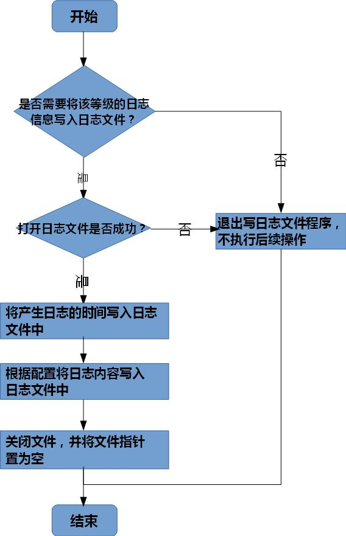

# Calculator

使用C语言实现计算器，最初版本可能会比较简单和幼稚，需要持续更新迭代

# 需求

## Caculator 需求

1. 终端显示输入输出
2. 进行四则运算

## 引申需求

### 简易log系统

简单实现一个log系统，执行原理就是简单的文件读写，将相关需要打印内容打印到文件中。

并且拥有较好的可扩展性和可配置。

#### 日志系统框架

配置文件 <--- 读取 ---> 软件程序 <--- 生成 ---> 日志文件

#### 日志生成流程

1. 从配置文件读取有关的日志配置信息
2. 读取失败使用默认配置，成功使用文件中配置信息
3. 编写日志生成函数
4. 调用日志生成函数将相关信息输出到日志文件中
5. 日志文件生成

#### 日志文件命令以及日志信息格式

日志文件命名：Log.log

生成位置：程序运行目录下

日志信息格式：\[日志生成时间\]  \[日志等级\] \[文件名\] \[函数名\] \[代码行\] 具体日志信息

#### 配置文件

// TODO 后期实现

#### 向日志文件中写入日志信息

# 编译

使用 `cmake`进行编译、发布